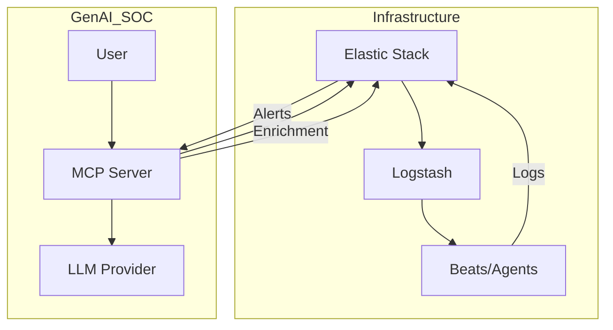

# Elastic-SecOps-Mastery


**Next-Generation Security Operations Center (SOC) framework combining hardened Elastic Stack infrastructure with Generative AI analysis.**

---

## 🏗️ Architecture



## 🚀 Key Features

*   **Automated Infrastructure**: Deployment scripts for a production-ready Elastic Stack.
*   **AI-Driven Analysis**: Python-based MCP server that auto-enriches alerts with LLM insights.
*   **Threat Hunting**: Pre-built KQL queries and scenarios for advanced detection.
*   **Modular Design**: Clean separation between infrastructure (`infrastructure/`) and application logic (`genai-soc/`).

## 📂 Directory Structure

*   `infrastructure/`: Configuration and build scripts for Elasticsearch, Kibana, and Logstash.
*   `infrastructure/genai-soc/`: The Python application handling AI integration.
*   `docs/`: Comprehensive guides and scenarios.

---

## ⚡ Quick Start

### 1. Build Infrastructure
Navigate to `infrastructure/` and configure your stack.
```bash
cd infrastructure
# Run your deployment scripts (e.g., docker-compose up -d)
```

### 2. Connect GenAI SOC
Set up the AI analysis engine.
```bash
cd infrastructure/genai-soc
cp .env.example .env  # Add your API keys
pip install -r requirements.txt
python server.py
```

### 3. Start Hunting
Check `docs/hunting.md` for your first scenario.

---

## 📚 Documentation

### Core Concepts
*   [Project Context & History](docs/project_context.md)
*   [Architecture](docs/architecture.md)

### Setup Guides
*   [Docker (Quickstart)](docs/setup_docker.md)
*   [Kubernetes (Production)](docs/setup_kubernetes.md)
*   [Bare Metal](docs/setup_baremetal.md)
*   [GenAI SOC Service](docs/setup_genai.md)

### Configuration Details
*   [Elasticsearch](docs/component_elasticsearch.md)
*   [Kibana](docs/component_kibana.md)
*   [Logstash](docs/component_logstash.md)
*   [Windows GPO](docs/config_gpo.md)

### Operations
*   [Usage Guide](docs/usage.md)
*   [Threat Hunting](docs/hunting.md)
*   [Troubleshooting](docs/troubleshooting.md)

## 🤝 Contributing

Contributions are welcome! Please read `docs/CONTRIBUTING.md` (coming soon).
