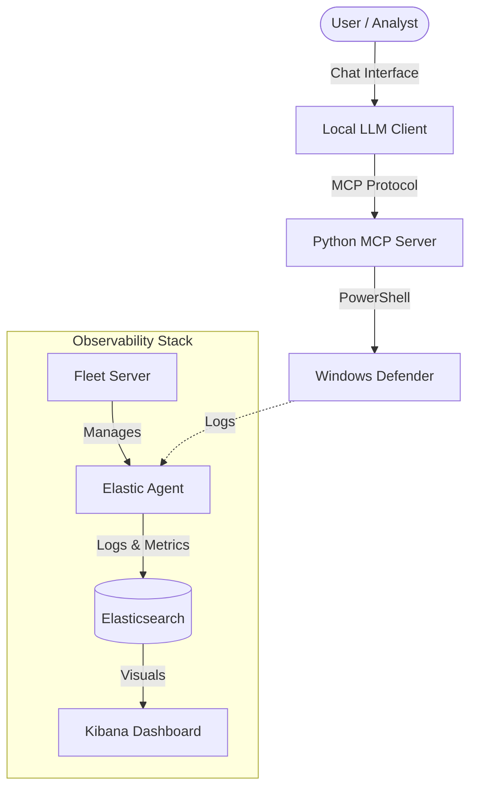

# Architecture & Resource Guide

This document outlines the system architecture, hardware requirements, and internal mechanisms of **Elastic-GenAI-SOC**.

## 1. System Architecture

The following diagram illustrates how the components interact:



### Components Role
1.  **Local LLM Client**: The brain. It processes user queries (e.g., "Is my system safe?") and decides which tool to call.
2.  **MCP Server**: The bridge. It translates LLM tool calls into actual PowerShell commands.
3.  **Windows Defender**: The enforcer. Executes scans and provides status.
4.  **Elastic Stack**: The memory. Records all activities, logs, and system metrics for historical analysis.

---

## 2. Resource Requirements

### 2.1 Endpoint (The Machine being protected)
This is where the MCP Server and Windows Defender run.
*   **OS**: Windows 10/11 or Windows Server 2019+.
*   **CPU**: 2+ Cores.
*   **RAM**: 4GB+ (Reserved for OS + Agent + Python Server).

### 2.2 LLM Node (The Brain)
If you are running the LLM locally (e.g., Ollama with Llama 3):
*   **RAM**: Minimum **8GB** (16GB Recommended).
*   **GPU**: NVIDIA GPU with 6GB+ VRAM recommended.

### 2.3 Elastic Stack (The Observer)
*   **Recommended**: 4 vCPUs, 8GB+ RAM, SSD Storage.

---

## 3. Ingestion Architecture: Logstash & Beats

### 3.1 Logstash: The ETL Engine
Logstash runs on JRuby and uses a **Persistent Queue (PQ)** architecture for durability.
*   **Page Files**: The queue represents a sequence of fixed-size "page files" (append-only logs).
*   **Crash Recovery**: Checkpointing tracks processing state to ensure at-least-once delivery.

### 3.2 Beats and Backpressure
Beats use the **Lumberjack Protocol (v2)** to ship logs reliable.
*   **Ring Buffer**: Libbeat uses a mutex-protected ring buffer for high throughput.
*   **Backpressure**: If Elasticsearch slows down, ACKs are delayed, propagating backpressure to the input file reader to prevent memory overflows.

---

## 4. Elastic Security Engine

### 4.1 Elastic Common Schema (ECS)
The foundation of standardization.
*   **Hierarchy**: Strict naming (e.g., `source.ip`, `event.action`).
*   **Reusability**: Rules work across any compliant data source (Sysmon, Windows Events, etc.).

### 4.2 Endpoint & Reflex Engine
*   **Reflex Engine**: Runs as a privileged service to evaluate events locally against prevention policies.
*   **Autonomous Response**: Can terminate malicious processes sub-millisecond without network connectivity.

### 4.3 Event Query Language (EQL)
EQL enables complex threat hunting by correlating events over time.

**Sequence Query Example**:
```eql
sequence by host.id with maxspan=1m
  [process where event.type == "start" and process.name == "cmd.exe"]
  [network where destination.port == 443]
```
